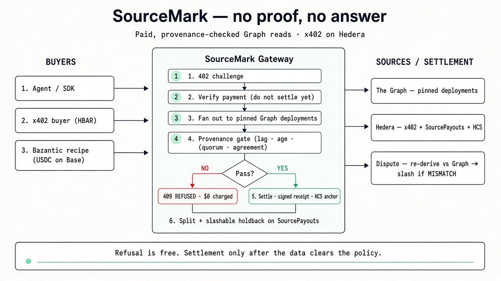

# SourceMark — no proof, no answer

**A paid read layer for onchain data that refuses to answer when it cannot prove provenance, pays the sources that answered, and slashes the ones that lie.**

Built from scratch for [ETHOnline 2026](https://ethglobal.com/events/ethonline2026) (Classic / From Scratch).  
Data from [The Graph](https://thegraph.com) · payments over x402 on Hedera testnet via [Blocky402](https://blocky402.com) · distribution through [Bazantic](https://bazantic.com) for agents that pay in USDC on Base.

| | |
| --- | --- |
| **Live gateway** | https://source-mark-production.up.railway.app |
| **Live demo UI** | https://source-mark-production.up.railway.app/demo |
| **OpenAPI** | https://source-mark-production.up.railway.app/openapi.json |
| **Repo** | https://github.com/KartikDehru/source-mark |
| **Author** | [Kartik Dehru](https://github.com/KartikDehru) |

<p align="center">
  
</p>

```bash
curl -i "https://source-mark-production.up.railway.app/v1/reads/aave-v3-ethereum?metric=supplyAPY&asset=USDC"
# HTTP/1.1 402 Payment Required
```

---

## What’s live

| Capability | Status | How to verify |
| --- | --- | --- |
| Unpaid → real HTTP **402** (x402 / Hedera) | Live | `curl -i` the reads URL above |
| Paid → Graph fan-out + provenance gate → **200** + signed receipt | Live | `npm run pay` or demo “Run the buying agent” |
| Policy fail → **409 REFUSED**, **not charged** | Live | `npm run pay -- --strict-age 1` |
| Onchain split + slashable holdback (`SourcePayouts`) | Live | Contract below · `npm run payouts:status` |
| Dispute: Graph re-derive · MATCH reject · MISMATCH slash + onchain open/resolve | Live | Demo challenge / falsified twin · `POST /v1/disputes` |
| HCS receipt digests | Live when configured | `/health` → `hcs` |
| Multi-page site (home · demo · explore · sdk) | Live | `/` `/demo` `/explore` `/sdk` |
| Thin TypeScript SDK | Shipped | [`sdk/`](./sdk) |
| MCP server + `SKILL.md` | Shipped | [`mcp/`](./mcp) · `npm run mcp:smoke` |
| Bazantic gateway + recipe (SourceMark + Hedera Mirror Node) | Live | [`bazantic/SETUP.md`](./bazantic/SETUP.md) · [`recipe JSON`](./bazantic/recipe-sourcemark-proven-lending-rate.json) |

**Limits:**

1. Payees are **opt-in demo operators** (EIP-191 consent is real; production indexer teams have not necessarily registered).
2. Disputes are **evidence-backed, not fully trustless** (Graph re-derive offchain; onchain open + arbiter or deadline uphold).
3. **Testnet scale** — Hedera testnet HBAR and a demo liability pool, not insurance.
4. **Resale float is operator-funded** — Bazantic USDC and our HBAR rails do not bridge.

---

## The problem

An agent that reads onchain data and then *acts* on it has a correctness problem no dashboard has. A stale number in a UI is a cosmetic bug. A stale number fed to a transaction is a loss.

Today, three things are broken at once:

- **Nobody agrees on what conforms to a standard.** Want every lending market that speaks the standardized Messari schema? You hand-build that registry yourself. So does everyone else.
- **Freshness is self-reported and advisory.** A subgraph tells you its own indexed block. Nothing forces you to check it, and nothing happens to the provider when it's wrong.
- **The sources capture none of the value.** A gateway monetises the query; the deployments that actually produced the answer aren't in the payment path.

---

## What this does

One endpoint, priced per call:

```
GET /v1/reads/:family?metric=<metric>&asset=<symbol>
```

1. **Unpaid → a real HTTP 402** carrying x402 payment requirements. No key, no account, no signup.
2. **Paid → verify first, work second.** The payment is verified with the facilitator but *not settled yet*.
3. **Fan out across a schema family.** The registry maps the family to N pinned deployment IDs; the same query goes to all of them.
4. **Enforce provenance.** Every source must be within the block-lag and age bounds, must report no indexing errors, and must match its pinned deployment ID. Failures are dropped, with a reason.
5. **Refuse, or answer.** Below quorum → `409 REFUSED`, and the payment is **never settled**. Above quorum → settle, then answer.
6. **Receipt.** Signed, naming every contributing deployment and the exact block its claim rests on. When HCS is configured, the digest is also published to a Hedera consensus topic.
7. **Split.** The settled amount goes to the sources that answered, minus a routing fee, with a slice held back unvested.
8. **Dispute.** Anyone can re-derive a receipt against The Graph. MATCH → rejected, no slash. MISMATCH → ledger slash and onchain `openDispute`; arbiter may resolve early, or after `disputeResolveSeconds` anyone may call `resolveAfterDeadline`.

### The bit that makes it honest

**Refusal is free.** Settlement happens *after* the read passes the policy, so a question the service can't answer truthfully costs the buyer nothing. It's structurally unable to profit from a guess.

That property falls out of one design decision: `verify` and `settle` are separate facilitator calls, made at different points in the request.

```
                 ┌────────────────────────────────────────┐
  agent ───────▶ │ ① no X-PAYMENT   → 402 + requirements  │
                 │ ② X-PAYMENT      → verify (NOT settle) │
                 │ ③ fan out to pinned deployments        │
                 │ ④ freshness gate vs real chain head    │
       409 ◀─────│    ├── below quorum → REFUSE, no charge│
                 │    └── above quorum → ⑤ settle         │
       200 ◀─────│ ⑥ signed receipt · split · holdback    │
                 └────────────────────────────────────────┘
```

---

## Quickstart

```bash
git clone https://github.com/KartikDehru/source-mark.git
cd source-mark
npm install
cp .env.example .env
```

Fill in `.env`:

| Variable | Where to get it |
| --- | --- |
| `GRAPH_API_KEY` | [thegraph.com/studio](https://thegraph.com/studio) → API Keys (required; without it every read refuses) |
| `X402_PAY_TO` | A Hedera testnet account id from [portal.hedera.com](https://portal.hedera.com) |
| `BUYER_ACCOUNT_ID` / `BUYER_PRIVATE_KEY` | A **second**, funded Hedera testnet account — this is the one that pays |
| `RECEIPT_SIGNING_KEY` | `node -e "console.log(require('crypto').randomBytes(32).toString('hex'))"` |
| `RESALE_API_KEY` | Optional. Shared secret a reseller gateway forwards. Unset → resale channel off (fails closed). |
| `SOURCE_PAYOUTS_ADDRESS` | After `npm run payouts:deploy` (onchain split mode) |
| `DEMO_SOURCE_MNEMONIC` | Dedicated demo payee mnemonic (not the public Hardhat phrase) |

The registry ships with two families already pinned to live mainnet deployments. Verify them, then start:

```bash
npm run registry:doctor    # live-pings every source, checks lag + schema identity
npm run dev                # http://localhost:8787
```

To add sources, find conforming deployments and paste the generated entries into `registry/families.json`:

```bash
npm run discover -- --search aave
npm run discover -- --schema QmNnWjciPb8Qy83RmdgctZmwzwofamjkfmkd5NjK1Swwsa --network mainnet --live
```

Verify the paywall:

```bash
curl -i "http://localhost:8787/v1/reads/aave-v3-ethereum?metric=supplyAPY&asset=USDC"
```

Pay for a read, and force a refusal:

```bash
npm run pay                          # 402 → sign → settle → answer + receipt
npm run pay -- --strict-age 1        # impossible freshness → 409, not charged
npm run agent -- --interval 30       # autonomous buyer on a loop
```

`--strict-age` is the reliable refusal lever rather than `--strict-lag`: healthy sources routinely sit at lag 0, so a lag bound cannot be made to fail on demand, but a source is always at least a few seconds old.

Or open **http://localhost:8787/demo** (also `/`, `/explore`, `/sdk`):

- Pick a family and metric from the live registry
- Get the raw 402, pay with the live buyer agent, force a refusal, or arrive via the resale channel
- After a paid read: signed receipt, onchain split, challenge / falsified-twin dispute
- Explore tabs render public endpoints (registry, policy, payouts, disputes, agent intents, health)

The demo buttons that spend money (`POST /demo/run`, `POST /demo/resale`) are rate limited — unauthenticated by design, otherwise they would drain the demo accounts. The paid endpoint needs no such limit: it charges per request.

To expose a local instance publicly (reseller gateways that fetch the spec server-side):

```bash
npm run tunnel    # prints URL, writes PUBLIC_URL, waits until it really answers
```

### No Graph key yet?

The service still starts and still serves its 402. Every read will `REFUSE` with `SOURCES_UNPINNED`. That's deliberate — it will never substitute fixtures for live data.

### Degradation flags

| Flag | Values | Effect |
| --- | --- | --- |
| `PAYMENT_MODE` | `x402` \| `free` | `free` drops the paywall; the read layer and refusals work unchanged. |
| `SPLIT_MODE` | `ledger` \| `onchain` | `ledger` writes payouts to an auditable local file; `onchain` uses `SourcePayouts.sol`. |
| `ANCHOR_MODE` | `rpc` \| `relative` | `rpc` compares to true chain head; `relative` compares sources to their best peer (weaker, labelled in every response). |

---

## API

| Route | What it does |
| --- | --- |
| `GET /v1/reads/:family` | The gate. 402 unpaid · 200 with receipt · 409 refused and uncharged. |
| `GET /v1/registry` | Conformance registry as data. Adding a protocol is one entry, zero code. |
| `GET /v1/policy/:family` | Freshness policy and available metrics. |
| `GET /v1/receipts/:digest` | Signed evidence + how to re-derive / verify. |
| `POST /v1/disputes` | Challenge a receipt (Graph re-derive → reject or slash). |
| `POST /v1/disputes/resolve-deadline` | Permissionless onchain uphold after arbiter silence. |
| `GET /v1/disputes` | Dispute log. |
| `GET /v1/payouts` | Per-source: earned, cleared, held back, slashed. |
| `GET /v1/agent-intents` | Signed ENTER/HOLD decisions from the acting buyer. |
| `GET /v1/consent` · `POST /v1/consent` | List or submit EIP-191 opt-ins from a source payout address. |
| `GET /health` | Modes, facilitator, split contract, arbiter, consent, resale float, family readiness, warnings. |
| `GET /openapi.json` | OpenAPI 3.1 (402 and 409 as ordinary responses). |
| `GET /` `/demo` `/explore` `/sdk` | Multi-page site. |
| `POST /demo/run` | Real buyer loop. Rate limited. |
| `POST /demo/resale` | Resale credential server-side (browser never holds it). Rate limited. |
| `POST /demo/falsify-receipt` | Demo-only: corrupt a receipt twin for the MISMATCH path. |
| `POST /demo/run-act` | Acting agent: pay → decide → confirm → signed intent. |

<details>
<summary><b>Sample 402</b></summary>

```json
{
  "error": "PAYMENT_REQUIRED",
  "x402Version": 2,
  "accepts": [{
    "scheme": "exact",
    "network": "hedera:testnet",
    "amount": "100000",
    "payTo": "0.0.10409341",
    "asset": "0.0.0",
    "maxTimeoutSeconds": 300,
    "extra": { "feePayer": "0.0.7162784" }
  }],
  "policy": { "maxBlockLag": 50, "maxAgeSeconds": 600, "minSources": 2 },
  "note": "Settlement occurs only if the read satisfies the policy. A refused read is never charged."
}
```

The `feePayer` is read live from the facilitator's `/supported` endpoint on every challenge, not hardcoded.
</details>

<details>
<summary><b>Sample refusal</b></summary>

```json
{
  "error": "REFUSED",
  "reason": "QUORUM_NOT_MET",
  "survived": 1, "required": 2,
  "sources": [
    { "protocol": "aave-v3-ethereum",     "status": "OK",       "block": 23110441, "blockLag": 3 },
    { "protocol": "compound-v3-ethereum", "status": "REJECTED", "why": "BLOCK_LAG_EXCEEDED", "detail": "918 > 50" },
    { "protocol": "spark-ethereum",       "status": "REJECTED", "why": "INDEXING_ERRORS" }
  ],
  "settled": false,
  "note": "Payment was verified but deliberately not settled. You have not been charged."
}
```
</details>

---

## How it's made

**The registry is data, not code.** `registry/families.json` maps a schema family to the deployments that claim to speak it, plus one query template and the metric definitions. Adding a protocol is an edit to that file. Nothing in `src/` knows what Aave is.

**Conformance is byte-identity, not a label.** A family declares a `schemaIpfsHash`, and `npm run registry:doctor` asks The Graph's own network subgraph what schema each pinned deployment actually uses. If the hashes are not identical, the source does not belong. `npm run discover -- --schema <hash>` walks the same index in reverse to find conforming deployments.

**Sources that should agree are held to it; sources that shouldn't, aren't.** Each family declares its `comparability`:

- `identical` — same protocol, same chain, same schema. Must agree within `agreementToleranceBps` or the read is **refused** (recent and wrong is still wrong).
- `peer` — different protocols that share a schema. Spread is market information, not a fault. Peer headlines are TVL-weighted; dead pools stay in the per-source table but cannot move the headline.

**Deployment IDs are pinned, and the pin is enforced.** Every response carries `_meta.deployment`. If the gateway serves anything other than the ID we pinned, the response is dropped.

**Freshness is measured against real chain head.** `ANCHOR_MODE=rpc` looks up the chain. The weaker best-peer fallback exists, but every response says which reference it used.

**Verify and settle are deliberately split.** The facilitator exposes them as separate calls, so we verify before work and settle only after the answer clears the policy.

**Liability comes out of revenue, not collateral.** A slice of every payout is held back unvested. That slice is the dispute pool. `SourcePayouts.sol` gives the operator no path to source balances and no rescue sweep.

**The buyer ships with the seller.** `src/buyer.ts` backs the in-page agent, the CLI, and the loop.

**Resale does not loosen the policy.** Bazantic settles callers in USDC on Base; we price in HBAR on Hedera. Those rails do not meet, so the Bazantic gateway uses **api-key** auth (`RESALE_API_KEY`) rather than pretending an `x402-mpp` payer can answer a Hedera challenge. The reseller bills upstream; the operator float covers the inbound HBAR leg; sources are still paid onchain with the same split, holdback, and liability. Both channels run one `completeRead()`, so refusal cannot be skipped on resale. Receipts carry `channel: "resale"` when that path was used. An unset `RESALE_API_KEY` matches nothing (fails closed).

### Stack

| | |
| --- | --- |
| Gateway | TypeScript · [Hono](https://hono.dev) · Node 22 |
| Data | The Graph decentralized gateway, standardized schemas, pinned deployment IDs |
| Payments | x402 v2 · `exact` · `hedera:testnet` · [Blocky402](https://blocky402.com) · `@x402/hedera` |
| Receipts | keccak256 over canonical JSON, EIP-191 via viem · optional [HCS topic](https://hashscan.io/testnet/topic/0.0.10444789) |
| Contract | Solidity 0.8.24 — `contracts/SourcePayouts.sol` |
| Agents | MCP server + `SKILL.md` in `mcp/` · thin client in `sdk/` |
| Distribution | Bazantic gateway + recipe (SourceMark + Hedera Mirror Node) — see `bazantic/` |

### Deployed contracts

| Contract | Network | Address |
| --- | --- | --- |
| `SourcePayouts` | Hedera testnet (296) | [`0x5c88d2722a0c883fbbbc8e60a10db4353e6c7cbd`](https://hashscan.io/testnet/contract/0x5c88d2722a0c883fbbbc8e60a10db4353e6c7cbd) |

Pinned deployments are registered as sources. `npm run payouts:status` reads the contract and checks every tinybar is attributed to routing fee, cleared balance, or holdback.

**Dispute bond units (Hedera):** `disputeBond` is stored in **tinybar** (what `msg.value` arrives as after the JSON-RPC relay). Callers send `bond × 1e10` weibar so `openDispute` matches.

### Payees and consent

Payees are **dedicated demo source operators** derived from `DEMO_SOURCE_MNEMONIC` (not the gateway operator, not the public Hardhat `test test … junk` phrase). Production indexer teams have not necessarily registered keys.

`POST /v1/consent` accepts an EIP-191 signature from the registered payout address and overlays `consent: consented` on the live registry. `npm run consent:demo -- --url=<gateway>` opts the demo payees in.

### Verified end to end

Claims below were confirmed against live services.

**A paid read settles.** Hedera testnet transaction
[`0.0.7162784@1788816238.698547026`](https://hashscan.io/testnet/transaction/0.0.7162784%401788816238.698547026),
result `SUCCESS`:

| Account | Change | Role |
| --- | --- | --- |
| `0.0.10409983` | −100,000 tinybar | buyer — pays the price, and only the price |
| `0.0.10409341` | +100,000 tinybar | gateway — read revenue |
| `0.0.7162784` | −242,480 tinybar | facilitator — absorbs gas, per Hedera's x402 scheme |

Answer: USDC supply APY at a live block from two independently operated Aave V3 deployments (spread 0 bps), with a signed receipt.

**A refused read costs nothing.** Valid payment verified; freshness policy failed; gateway declined to settle; buyer balance delta **0**.

**The split lands onchain, and a source can withdraw it.** With `SPLIT_MODE=onchain`, `recordRead()` runs in the same request. Example claim tx:
[`0x02f8fff8d2372bb14e9f6666483b65a628a45abf203b6d602912eed1f4c45b63`](https://hashscan.io/testnet/transaction/0x02f8fff8d2372bb14e9f6666483b65a628a45abf203b6d602912eed1f4c45b63)
— owed tinybar matched received HBAR; holdback stayed withheld.

**Resale: dollars in on Base, source payouts out on Hedera.** Through the Bazantic gateway
[`kz46uwbv5fewjo2l57uuvnzajq.bazgateway.com`](https://kz46uwbv5fewjo2l57uuvnzajq.bazgateway.com)
(also `sourcemark.bazgateway.com`), a caller paid **$0.01 USDC on Base**; the read still cleared the Graph policy; sources were paid in HBAR in
[`0xe2d834345a98109b0da0e11bbe85992b16907afcaa172882fa1bdf111d9b3041`](https://hashscan.io/testnet/transaction/0xe2d834345a98109b0da0e11bbe85992b16907afcaa172882fa1bdf111d9b3041).
`strictAge=1` on that channel still returns `409`, free, `channel: "resale"`.

**Bazantic track.** Gateway registered; recipe pairs SourceMark with Hedera Mirror Node:

- Setup: [`bazantic/SETUP.md`](./bazantic/SETUP.md)
- Recipe JSON: [`bazantic/recipe-sourcemark-proven-lending-rate.json`](./bazantic/recipe-sourcemark-proven-lending-rate.json)

Agent tooling for this repo lives in [`mcp/`](./mcp) (stdio MCP server + `SKILL.md`).

Reproduce locally:

```bash
npm run pay
npm run pay -- --strict-age 1
npm run payouts:status
npx tsx scripts/claim-demo.ts
npm run mcp:smoke
```

> **Hedera unit trap.** Inside a contract `msg.value` arrives in **tinybar** (relay divides weibar by 1e10) while `eth_getBalance` answers in **weibar**. Comparing them raw looks off by 1e10. `scripts/claim-demo.ts` checks owed-against-received on-chain.

---

## What this does **not** do

1. **Payees are opt-in demo operators.** Consent is real EIP-191. Production indexer teams have not necessarily registered.
2. **Disputes are evidence-backed, not fully trustless.** Graph re-derive offchain; onchain open plus arbiter or deadline uphold.
3. **Testnet scale.** Hedera testnet HBAR and a demo liability pool — not insurance.
4. **Resale float is operator-funded.** Bazantic USDC and our HBAR rails do not bridge.

---

## Repo

```
src/          gateway: registry · graph · anchor · resolver · x402 · receipt · split · server
sdk/          thin TypeScript client for the HTTP API
registry/     families.json — the conformance registry (data)
client/       one-shot CLI buyer
agent/        autonomous buyer on a loop
mcp/          MCP server + SKILL.md
contracts/    SourcePayouts.sol
public/       multi-page site (home · demo · explore · sdk) + brand assets
bazantic/     gateway/recipe notes + public recipe JSON
test/         aggregation + freshness tests; test/contracts/ for Solidity
scripts/      doctors and one-shot tools (below)
```

| Script | What it is for |
| --- | --- |
| `registry:doctor` | Live source health + schema hash match |
| `hedera:doctor` | Payment rail preflight |
| `mcp:smoke` | MCP stdio client through answered and refused paths |
| `discover` | Find deployments sharing a schema hash |
| `payouts:deploy` | Deploy `SourcePayouts` and register sources |
| `payouts:status` | Read contract state / solvency |
| `payouts:set-arbiter` | Rotate onchain arbiter to `ARBITER_ADDRESS` |
| `consent:demo` | EIP-191 consent for demo payees (`--url=` for Railway) |
| `claim-demo` | Claim as a source; verify owed matches received |
| `rpc-probe` | Raw Hedera relay status codes |
| `tunnel` | Public HTTPS URL + `PUBLIC_URL` |

AI tool attribution: **[AI-USAGE.md](./AI-USAGE.md)**

```bash
npm run typecheck
npm test
npm run contracts:test
```

## Author

**Kartik Dehru** — [kartikdehru2003@gmail.com](mailto:kartikdehru2003@gmail.com) · [GitHub](https://github.com/KartikDehru)

Built solo for [ETHOnline 2026](https://ethglobal.com/events/ethonline2026).

## License

MIT
